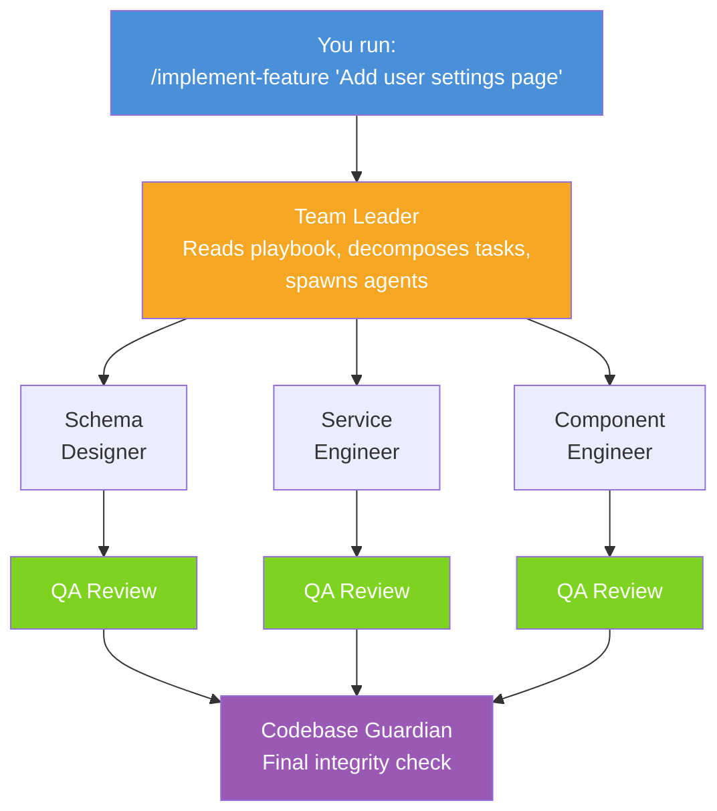
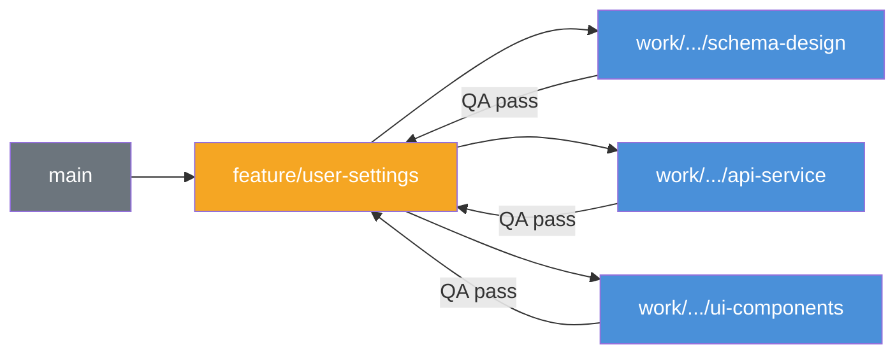

# create-claude-workflow

Multi-agent feature development for Claude Code -- agents plan before coding, work on isolated branches, get reviewed, and merge cleanly.

```
npx create-claude-workflow init
```

---

## Quick Start

1. **Scaffold** -- `npx create-claude-workflow init`
2. **Generate agents** -- `/discover-agents`
3. **Build a feature** -- `/implement-feature "add user authentication"`

---

## What Happens When You Run /implement-feature

One command kicks off a fully orchestrated, multi-agent development pipeline:



Each coding agent gets its own QA reviewer on the same branch. Only after all agents pass QA does the Codebase Guardian run a final integrity check.

### Branching Model

Every task is isolated on its own branch -- no file conflicts, clean merges.



**Per-task lifecycle:**

1. Team Leader creates a work branch from `feature/` HEAD
2. Agent works and commits on the work branch
3. Agent spawns QA on the same work branch
4. QA: **FAIL** --> agent fixes --> new QA (max 3 rounds) | **PASS** --> QA updates docs on work branch --> commits
5. Team Leader rebases work branch onto `feature/` --> merges `--no-ff` --> deletes work branch
6. Next wave branches from updated `feature/` HEAD

---

## Why This Exists

| Problem | This Tool's Approach |
|---|---|
| Agents conflict on shared files | Branch-per-task + file scoping + sequential merges (5-layer prevention) |
| Agents go rogue, edit wrong files | Each agent has a scoped file list |
| QA happens at the end (too late) | QA runs per-agent on the work branch |
| Terminal crash = lost progress | Progress files on disk, auto-resume |
| Docs rot after features ship | QA updates docs on PASS + Guardian checks coherence at the end |
| Agents skip planning, debug blind | Superpowers skills are enforced |
| Don't know which agents to create | `/discover-agents` auto-detects your stack |
| Skills scattered, not integrated | Agents bundle relevant skills.sh skills |

---

## Core Commands

| Command | What It Does |
|---|---|
| `/implement-feature` | Full orchestration: branch, plan, spawn agents in waves, QA each task, Guardian check, PR |
| `/discover-agents` | Indexes codebase, detects tech stack, recommends agents, generates tailored agent definitions |
| `/resume-feature` | Scans progress files, shows in-progress features, resumes from where the last session left off |

---

## Extended Commands

> Ship with the workflow and are available when you need them. Zero context cost until invoked.

| Command | What It Does |
|---|---|
| `/claude-new` | Unified creation entry point: features, phases, tasks, plans, agents, or ideas |
| `/create-feature-plan` | Deep technical planning: codebase analysis, architecture design, task decomposition |
| `/hotfix` | Streamlined single-agent urgent fix: one agent, one QA round, fast mode |
| `/refactor` | Pre-flight baseline, analyze, plan, execute in waves, verify no regressions |
| `/generate-tests` | Identifies test targets, spawns test-engineer, QA verifies coverage quality |
| `/review-pr <number>` | Checks out a PR, spawns QA + Guardian, posts combined results as PR comment |
| `/scaffold-agent` | Interactive Q&A to generate a new agent definition with full phased workflow |
| `/audit-agents` | Scans agent definitions, compares scopes against project structure, flags issues |
| `/status` | Formatted summary of active feature progress: tasks, QA, branches, blockers |

---

## What Gets Installed

Everything lives under `.claude/` -- nothing is loaded into context until invoked.

```
your-project/
├── .claude/
│   ├── commands/
│   │   ├── create-feature-plan.md         <- deep planning for implement-feature
│   │   ├── implement-feature.md          <- full orchestration workflow
│   │   ├── discover-agents.md            <- auto-detect stack, generate agents
│   │   ├── resume-feature.md             <- resume crashed/paused features
│   │   ├── status.md                     <- show feature progress summary
│   │   ├── hotfix.md                     <- streamlined single-agent fix
│   │   ├── review-pr.md                  <- QA + Guardian on a pull request
│   │   ├── generate-tests.md             <- focused test generation
│   │   ├── refactor.md                   <- safe restructuring with baseline
│   │   ├── scaffold-agent.md             <- interactive agent creator
│   │   ├── audit-agents.md              <- check agent scopes vs codebase
│   │   └── claude-new.md               <- unified creation entry point
│   ├── agents/                           <- loaded per agent spawn (zero cost when idle)
│   │   ├── team-leader.md
│   │   ├── component-engineer.md
│   │   ├── qa-reviewer.md
│   │   ├── codebase-guardian.md
│   │   └── ...
│   └── prompts/
│       └── implementing-features/
│           ├── README.md                 <- master playbook (read by team-leader)
│           ├── QA-CHECKLIST-TEMPLATE.md
│           ├── PROGRESS-FILE-TEMPLATE.md
│           ├── AGENT-SPAWN-TEMPLATES.md
│           ├── WORKFLOW-MODES.md         <- strict/standard/fast mode definitions
│           ├── WAVE-FENCE-PROTOCOL.md    <- inter-wave synchronization
│           ├── PRE-FLIGHT-CHECKS.md      <- baseline verification before agents
│           ├── CONTEXT-BUDGET-GUIDE.md   <- context estimation and splitting
│           ├── QA-CHECKLIST-AUTO-FILL-RULES.md  <- role-based QA section mapping
│           ├── AGENT-PERFORMANCE-LOG-TEMPLATE.md <- QA performance tracking
│           └── IDEAS-BACKLOG-TEMPLATE.md <- idea backlog for /claude-new idea
├── docs/
│   ├── progress/                         <- runtime progress files (one per feature)
│   ├── CUSTOMIZING-THE-WORKFLOW.md       <- guide: adjusting phases, branching, QA
│   └── CREATING-AGENTS.md               <- guide: agent anatomy, creation, scoping
```

### Documentation

User-facing guides are installed to `docs/`:

| Guide | What It Covers |
|---|---|
| `CUSTOMIZING-THE-WORKFLOW.md` | Adjusting phases, branching, progress tracking, merge protocol, QA checks, workflow modes, template variables |
| `CREATING-AGENTS.md` | Agent anatomy, creating new agents, updating existing ones, scoping, naming, skills integration, testing |

### Context Cost

Nothing is loaded until you need it:

| File | When Loaded | Cost |
|---|---|---|
| `CLAUDE.md` | Always loaded | Keep lean |
| `.claude/commands/*.md` | On `/invoke` only | Zero cost |
| `.claude/agents/*.md` | On spawn only | Zero cost |
| `.claude/prompts/*` | On explicit read | Zero cost |

---

## Setup

### Quick Start

```bash
# Scaffold into an existing project
cd your-project
npx create-claude-workflow init

# Auto-detect your stack and generate tailored agents
/discover-agents

# Start orchestrated development
/implement-feature "your feature description"
```

### Manual Install

Copy the files from `templates/` into your project and customize the `.md` files directly.

### What Init Asks

```
? Project rules file:     CLAUDE.md
? Architecture file:      docs/ARCHITECTURE.md
? Progress directory:     docs/progress
```

That's it -- three questions, sensible defaults, done in seconds.

---

## Template Variables

Templates use `{{VARIABLE}}` substitution. Customize after scaffolding -- all output is plain `.md` you own.

| Variable | Example Value |
|---|---|
| `{{PROJECT_NAME}}` | my-app |
| `{{PROJECT_RULES_FILE}}` | CLAUDE.md |
| `{{ARCHITECTURE_FILE}}` | docs/ARCHITECTURE.md |
| `{{PROGRESS_DIR}}` | docs/progress |
| `{{AGENT_ROLE}}` | Service Engineer |
| `{{AGENT_FILE_SCOPE}}` | src/services/** |
| `{{AGENT_EXCLUDED_FILES}}` | src/components/** |

---

## Customization

The workflow is designed to be tailored to your project. Two guides ship with the install:

- **`docs/CUSTOMIZING-THE-WORKFLOW.md`** -- Adjusting phases, branching, progress tracking, merge protocol, QA checks, workflow modes, template variables
- **`docs/CREATING-AGENTS.md`** -- Agent anatomy, creating new agents, scoping, naming, skills integration, testing

---

## Roadmap

- [ ] Preset packs (`--preset=electron`, `--preset=react`)
- [ ] Easy sharing of Workflow / Agents / Commands between teams
- [ ] VS Code extension (progress in sidebar)

---

## License

MIT
