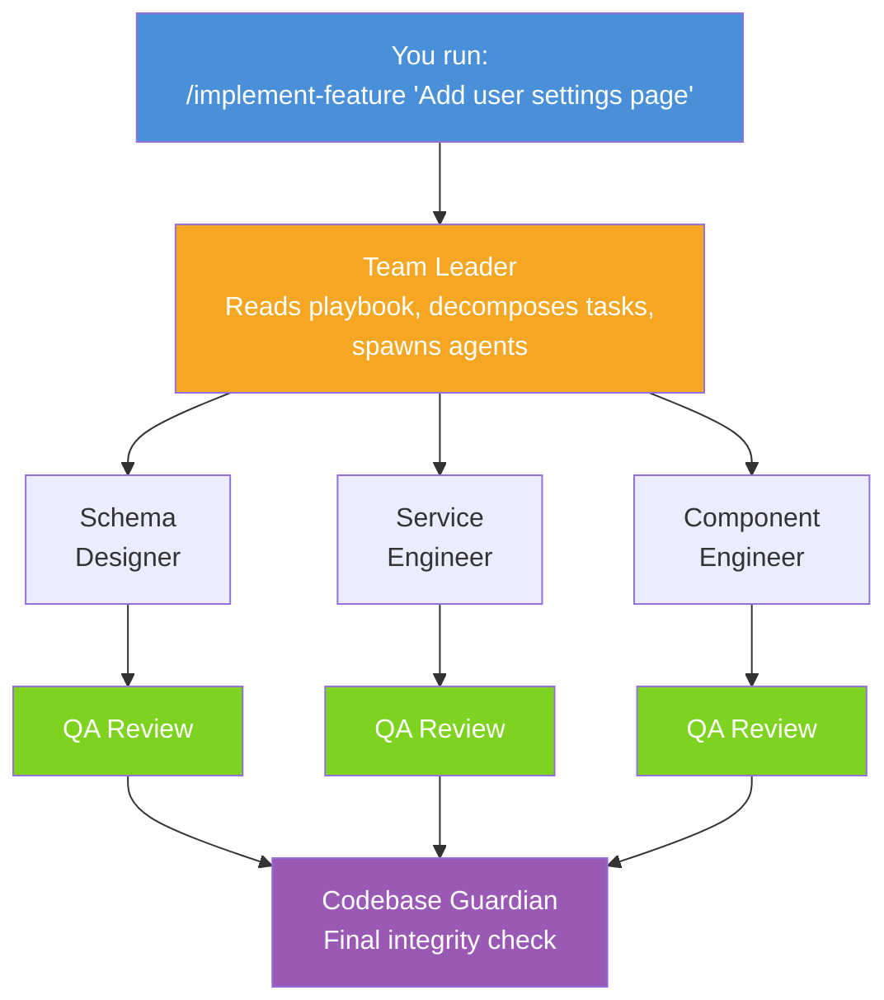
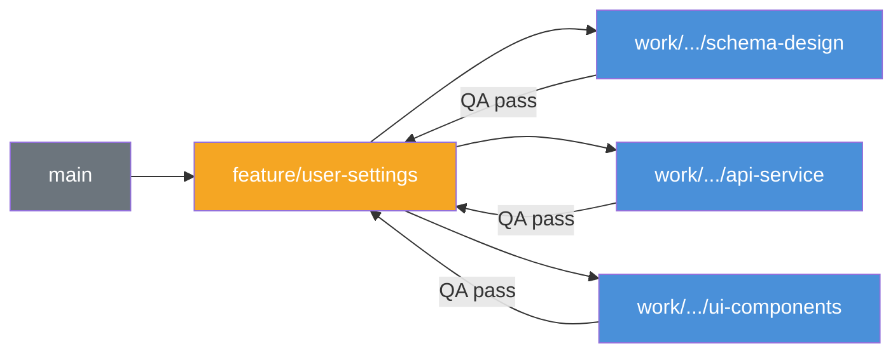
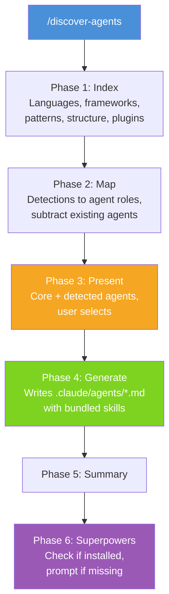

# create-claude-workflow

A Claude Code skill pack + npx scaffolder for orchestrating multi-agent feature development with crash-safe progress tracking, per-task QA, and automated documentation.

```
npx create-claude-workflow init
```

---

## How It Works

One command kicks off a fully orchestrated, multi-agent development pipeline. Here is the flow from start to finish:



Each coding agent gets its own QA reviewer on the same branch. Only after all agents pass QA does the Codebase Guardian run a final integrity check.

### Branching Model

Every task is isolated on its own branch -- no file conflicts, clean merges.



**Per-task lifecycle:**

1. Team Leader creates a work branch from `feature/` HEAD
2. Agent works and commits on the work branch
3. Agent spawns QA on the same work branch
4. QA: **FAIL** --> agent fixes --> new QA (max 3 rounds) | **PASS** --> QA updates docs on work branch --> commits
5. Team Leader rebases work branch onto `feature/` --> merges `--no-ff` --> deletes work branch
6. Next wave branches from updated `feature/` HEAD

---

## Features

At a glance, here is what you get out of the box:

| Feature | What It Does |
|---|---|
| :shield: Branch-per-task isolation | Each task gets its own work branch off `feature/` -- no file conflicts |
| :busts_in_silhouette: Team orchestration | Decomposes features into tasks, spawns specialist agents in waves |
| :floppy_disk: Crash-safe progress | Progress files on disk survive terminal closes -- new sessions auto-resume |
| :mag: Per-agent QA | Each coding agent spawns its own QA reviewer on the same work branch |
| :books: QA-driven doc updates | QA updates docs on PASS (not a separate agent), keeping branches self-contained |
| :lock: Codebase Guardian | Final structural integrity check on merged feature branch before PR |
| :detective: Auto agent discovery | `/discover-agents` indexes your codebase and recommends specialist agents |
| :link: Skills.sh integration | Agents auto-bundle relevant skills from the skills.sh marketplace |
| :zap: Superpowers enforcement | Agents must use thinking/planning/debugging skills -- no cowboy coding |
| :inbox_tray: Superpowers auto-install | Detects if plugin is missing, prompts to install, handles CLI restart notice |
| :gear: Workflow modes | Three modes (strict/standard/fast) control QA rounds, Guardian, pre-flight, and wave fences |
| :clipboard: QA auto-fill | Agent roles auto-select relevant QA checklist sections -- less boilerplate |
| :bar_chart: Performance tracking | QA logs agent performance per task -- data-driven agent improvement |
| :compass: Context budget | Estimates context usage before spawning -- prevents "ran out of context" failures |

---

## Commands

| Command | What It Does |
|---|---|
| `/discover-agents` | Indexes codebase --> detects tech stack --> recommends agents --> you pick --> generates tailored agent definitions with skills |
| `/implement-feature` | Runs the full orchestration workflow: branch --> plan --> spawn --> QA --> merge --> PR |
| `/resume-feature` | Scans progress files, shows in-progress features, resumes from where the last session left off |
| `/status` | Displays a formatted summary of the active feature's progress (tasks, QA, branches, blockers) |
| `/hotfix` | Streamlined single-agent urgent fix: branch --> one agent --> 1 QA round --> PR |
| `/review-pr <number>` | Checks out a PR, spawns QA + Guardian, posts combined results as a PR comment |
| `/generate-tests` | Identifies test targets, spawns test-engineer, QA verifies coverage quality |
| `/refactor` | Pre-flight baseline --> analyze --> plan --> execute waves --> verify no regressions |
| `/scaffold-agent` | Interactive Q&A to generate a new `.claude/agents/<role>.md` with full phased workflow |
| `/audit-agents` | Scans agent definitions, compares scopes against project structure, flags issues |

### /discover-agents Flow

The agent discovery process walks through six phases automatically:



### Skills.sh Integration

Agents auto-reference relevant skills from the marketplace. Here is the default mapping:

| Agent | Bundled skills.sh Skills |
|---|---|
| component-engineer | `vercel-labs/agent-skills` --> react-best-practices, web-design-guidelines, composition-patterns; `anthropics/skills` --> frontend-design |
| mobile-engineer | `vercel-labs/agent-skills` --> react-native-guidelines |
| styling-engineer | `anthropics/skills` --> frontend-design |
| qa-reviewer | `anthropics/skills` --> webapp-testing |
| test-engineer | `anthropics/skills` --> webapp-testing |
| Any agent | `anthropics/skills` --> mcp-builder (if MCP detected) |

---

## What Gets Installed

Everything lives under `.claude/` -- nothing is loaded into context until invoked.

```
your-project/
├── .claude/
│   ├── commands/
│   │   ├── implement-feature.md          <- full orchestration workflow
│   │   ├── discover-agents.md            <- auto-detect stack, generate agents
│   │   ├── resume-feature.md             <- resume crashed/paused features
│   │   ├── status.md                     <- show feature progress summary
│   │   ├── hotfix.md                     <- streamlined single-agent fix
│   │   ├── review-pr.md                  <- QA + Guardian on a pull request
│   │   ├── generate-tests.md             <- focused test generation
│   │   ├── refactor.md                   <- safe restructuring with baseline
│   │   ├── scaffold-agent.md             <- interactive agent creator
│   │   └── audit-agents.md              <- check agent scopes vs codebase
│   ├── agents/                           <- loaded per agent spawn (zero cost when idle)
│   │   ├── team-leader.md
│   │   ├── component-engineer.md
│   │   ├── qa-reviewer.md
│   │   ├── codebase-guardian.md
│   │   └── ...
│   └── prompts/
│       └── implementing-features/
│           ├── README.md                 <- master playbook (read by team-leader)
│           ├── QA-CHECKLIST-TEMPLATE.md
│           ├── PROGRESS-FILE-TEMPLATE.md
│           ├── AGENT-SPAWN-TEMPLATES.md
│           ├── WORKFLOW-MODES.md         <- strict/standard/fast mode definitions
│           ├── WAVE-FENCE-PROTOCOL.md    <- inter-wave synchronization
│           ├── PRE-FLIGHT-CHECKS.md      <- baseline verification before agents
│           ├── CONTEXT-BUDGET-GUIDE.md   <- context estimation and splitting
│           ├── QA-CHECKLIST-AUTO-FILL-RULES.md  <- role-based QA section mapping
│           └── AGENT-PERFORMANCE-LOG-TEMPLATE.md <- QA performance tracking
├── docs/
│   ├── progress/                         <- runtime progress files (one per feature)
│   ├── CUSTOMIZING-THE-WORKFLOW.md       <- guide: adjusting phases, branching, QA
│   └── CREATING-AGENTS.md               <- guide: agent anatomy, creation, scoping
```

### Documentation

User-facing guides are installed to `docs/`:

| Guide | What It Covers |
|---|---|
| `CUSTOMIZING-THE-WORKFLOW.md` | Adjusting phases, branching, progress tracking, merge protocol, QA checks, workflow modes, template variables |
| `CREATING-AGENTS.md` | Agent anatomy, creating new agents, updating existing ones, scoping, naming, skills integration, testing |

### Context Cost

Nothing is loaded until you need it:

| File | When Loaded | Cost |
|---|---|---|
| `CLAUDE.md` | Always loaded | Keep lean |
| `.claude/commands/*.md` | On `/invoke` only | Zero cost |
| `.claude/agents/*.md` | On spawn only | Zero cost |
| `.claude/prompts/*` | On explicit read | Zero cost |

---

## Setup

### Quick Start

```bash
# Scaffold into an existing project
cd your-project
npx create-claude-workflow init

# Auto-detect your stack and generate tailored agents
/discover-agents

# Start orchestrated development
/implement-feature "your feature description"
```

### Interactive Prompts (init)

```
? Project type:              Electron / React / Node / Full-stack / Custom
? Include agent definitions? Yes - select roles / No - just templates
? Select agents:             team-leader, qa-reviewer, ...
? Electron MCP testing?      Yes / No
? Progress file directory:   docs/progress/
```

### Manual Install

Copy the files from `templates/` into your project and customize the `.md` files directly.

---

## Architecture

```
create-claude-workflow/
├── bin/index.js              <- CLI entry point
├── lib/
│   ├── scaffolder.js         <- file generation
│   ├── prompts.js            <- interactive questions
│   └── templates.js          <- template loading + variable substitution
├── templates/
│   ├── commands/             <- Claude Code skills
│   │   ├── implement-feature.md
│   │   └── discover-agents.md
│   ├── agents/               <- agent definitions (modular)
│   ├── prompts/              <- playbook + checklists
│   └── electron/             <- optional Electron QA protocol
├── package.json
└── README.md
```

---

## Template Variables

Templates use `{{VARIABLE}}` substitution. Customize after scaffolding -- all output is plain `.md` you own.

| Variable | Example Value |
|---|---|
| `{{PROJECT_NAME}}` | my-app |
| `{{PROJECT_RULES_FILE}}` | CLAUDE.md |
| `{{ARCHITECTURE_FILE}}` | docs/ARCHITECTURE.md |
| `{{PROGRESS_DIR}}` | docs/progress |
| `{{AGENT_ROLE}}` | Service Engineer |
| `{{AGENT_FILE_SCOPE}}` | src/services/** |
| `{{AGENT_EXCLUDED_FILES}}` | src/components/** |

---

## Why This Exists

| Problem | This Tool's Approach |
|---|---|
| Agents conflict on shared files | Branch-per-task + file scoping + sequential merges (5-layer prevention) |
| Agents go rogue, edit wrong files | Each agent has a scoped file list |
| QA happens at the end (too late) | QA runs per-agent on the work branch |
| Terminal crash = lost progress | Progress files on disk, auto-resume |
| Docs rot after features ship | QA updates docs on PASS + Guardian checks coherence at the end |
| Agents skip planning, debug blind | Superpowers skills are enforced |
| Don't know which agents to create | `/discover-agents` auto-detects your stack |
| Skills scattered, not integrated | Agents bundle relevant skills.sh skills |

---

## Roadmap

- [ ] Preset packs (`--preset=electron`, `--preset=react`)
- [ ] Community agent marketplace
- [ ] Progress dashboard (web UI reading progress files)
- [ ] VS Code extension (progress in sidebar)

---

## License

MIT
